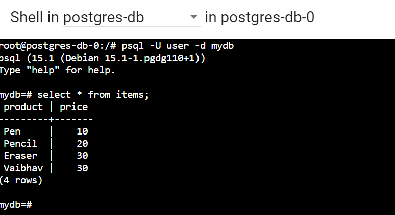
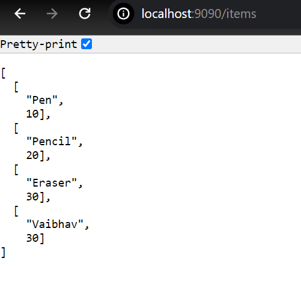

# Introduction

Let's break down the requirement for this assessment:

**Part 1: Database Deployment**

* **Goal:** Create a reliable and secure database accessible only within our Kubernetes cluster.
* **Tools & Concepts:**
    * **StatefulSets:** Use to manage the deployment of stateful applications like databases where data persistence is critical.
    * **Persistent Volumes:** Provide persistent storage that survives pod restarts or failures.
    * **Internal Services:** Expose the database within the cluster without making it externally accessible.
    * **ConfigMaps & Secrets:** Securely store and manage database credentials and connection details.
* **Specifics:**
    * Deploy a database (I used `PostgreSQL`).
    * Ensur only one database pod runs, but data is persisted even if the pod fails.
    * Use of ConfigMaps for non-sensitive configuration and Secrets for sensitive data like database credentials.

**Part 2: API Service Deployment**

* **Goal:** Develop and deploy a scalable API service that interacts with the database and is accessible from outside the Kubernetes cluster.
* **Tools & Concepts:**
    * **ReplicaSets and Deployment:** Ensure high availability and scalability by maintaining a desired number of API service replicas.
    * **Services:** Expose the API service externally, allowing communication from outside the cluster.
    * **Headless Services:** Enable service discovery without providing a fixed cluster IP address, suitable for connecting to stateful sets.
    * **ConfigMaps & Secrets:** Manage API configurations and securely store database connection details.
* **Specifics:**
    * Creat an API service (using Python Flash and jsonify) with three running pods for redundancy.
    * Make the API accessible from outside the cluster. (Used Port forwarding)
    * Implement API endpoints that retrieve data from the database.
    * Establish communication between the API service and the database using a headless service.
    * Securely store API configurations and database credentials using ConfigMaps and Secrets.

**Part 3: Horizontal Pod Autoscaling (HPA)**

* **Goal:** Demonstrate the ability to dynamically scale the API service based on resource utilization.
* **Tools & Concepts:**
    * **Horizontal Pod Autoscaler:** Automatically adjusts the number of pods in a deployment based on metrics like CPU or memory usage.
* **Specifics:**
    * Configure HPA for the API service to automatically scale the number of pods.
    * Test the HPA by increasing the load on the API service and observe the number of pods scaling up.

# Code

This repository demonstrates a simple two-tier microservices application deployed on a Kubernetes cluster. It includes a PostgreSQL database (deployed as a StatefulSet) and a Python Flask API service that interacts with the database. The API service is configured with Horizontal Pod Autoscaling (HPA) for dynamic scaling.

## Features

- **Persistent Database:** The PostgreSQL database ensures data persistence using PersistentVolumes.
- **Scalable API Tier:** The API service can be horizontally scaled using a Horizontal Pod Autoscaler (HPA) based on CPU utilization.
- **Internal & External Access:** The database is accessible only within the cluster, while the API is exposed externally for client access.
- **Configuration & Secrets Management:** Kubernetes ConfigMaps and Secrets are used to manage application configuration and sensitive data.


## Project Structure

```
NAGP-Assignment-II/
├── api/
│   ├── app.py               # Flask API application
│   |── requirements.txt
|   └── Dockerfile
├── api_objects/
│   |── api_deployment.yaml  # Deployment Config for API with replicas
|   |── api_hpa.yaml         # HPA configuration
|   └── api_service.yaml     # Service (Load Balancer)
|── database/
│   |── db_configMap.yaml    # ConfigMap data
|   |── db_secrets.yaml      # Sensitive secret data
│   |── db_service.yaml      # Headless Service
|   └── db_statefulset.yaml  # Statefulset config for db deployment
└── README.md                

```

## Getting Started

### Prerequisites

* A running Kubernetes cluster (minikube, Docker Desktop)
* kubectl CLI configured to interact with your cluster
* Docker installed (for building images)

### Deployment

1. **Clone the Repository:**
   ```bash
   git clone https://github.com/Vaib1990/NAGP-Assignment-II.git
   cd NAGP-Assignment-II
   ```

2. **Build and Push the API Image:**
   ```bash
   cd api
   docker build -t vsingham/api-service:2.0 .
   docker push vsingham/api-service:2.0
   ```

3. **Deploy Database:**
   ```bash
   cd ../database
   kubectl apply -f db_configMap.yaml
   kubectl apply -f db_secrets.yaml
   kubectl apply -f db_service.yaml
   kubectl apply -f db_statefulset.yaml
   ```

4. **Deploy API Service:**
   ```bash
   cd ../api_objects
   kubectl apply -f api_deployments.yaml
   kubectl apply -f api_service.yaml
   ```

5. **Deploy Horizontal Pod Autoscaler:**
   ```bash
   cd ../api_objects
   kubectl apply -f api_hpa.yaml
   ```

## Verification

1. **Create table in database:**
   - Run `minikube dashboard`
   - Connect to pod.
   - 

2. **Access the API:**
   ```bash
   kubectl port-forward service/api-service-service 9090:80
   ```
   - **URL:** http://localhost:9090/items
   - You should see data retrieved from the PostgreSQL database.
   - 

3. **Test HPA:**
   - Add a significant load to your API. 
   - Go inside the container and run `while :; do :; done`
   - Observe the pod count in the `api-service` deployment using `kubectl get pods`. The HPA should scale up the pods based on CPU utilization.
   - Now stop executing the command and check for pod count. After few minutes pod will scale down back to 3.

## Resources

* **Code Repository:** https://github.com/Vaib1990/NAGP-Assignment-II.git
* **Docker Image (API Service):** https://hub.docker.com/r/vsingham/api-service/tags
* **Service API Endpoint:** http://localhost:9090/items
* **Screen Recording Demo:** https://drive.google.com/file/d/1_HM7W4rEiNFb8mBrjz7HerFJnO3xgXfo/view?usp=sharing

## Notes

* **Configuration:**  We can adjust configurations like database credentials, resource limits in the YAML files as needed.
* **Security:** This is a basic example. We can implement robust security measures (TLS, RBAC, etc.) in a production environment. 